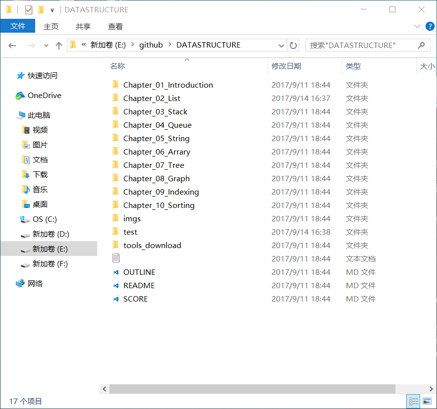
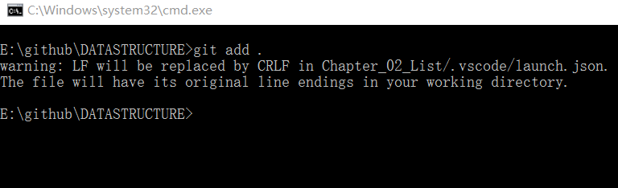
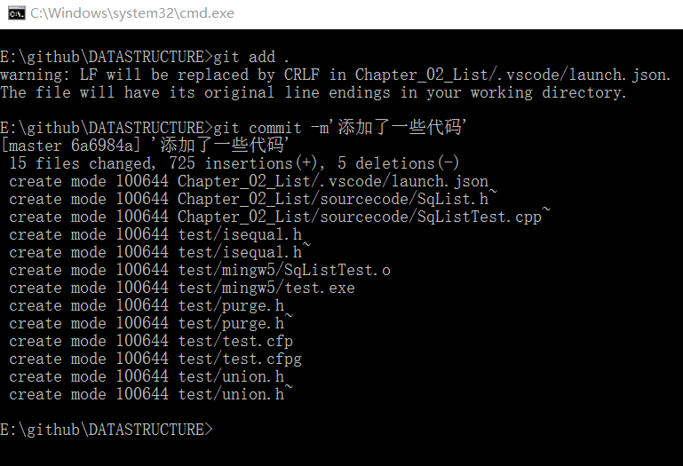
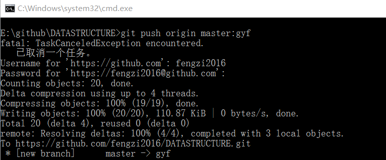
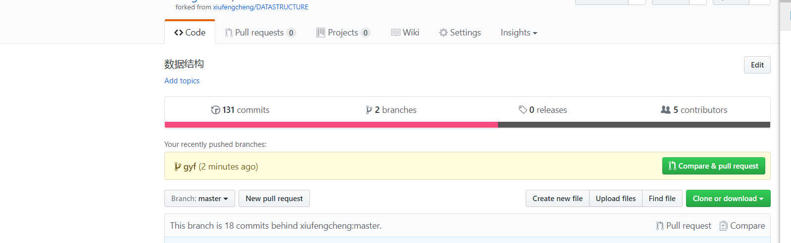
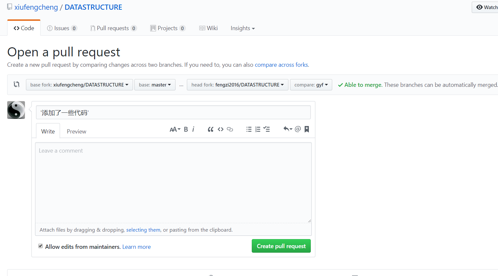
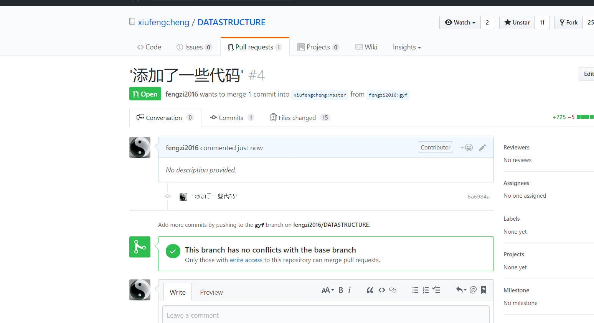
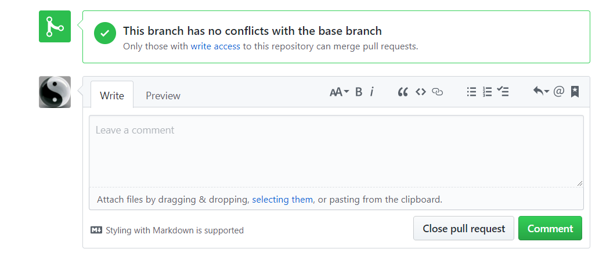
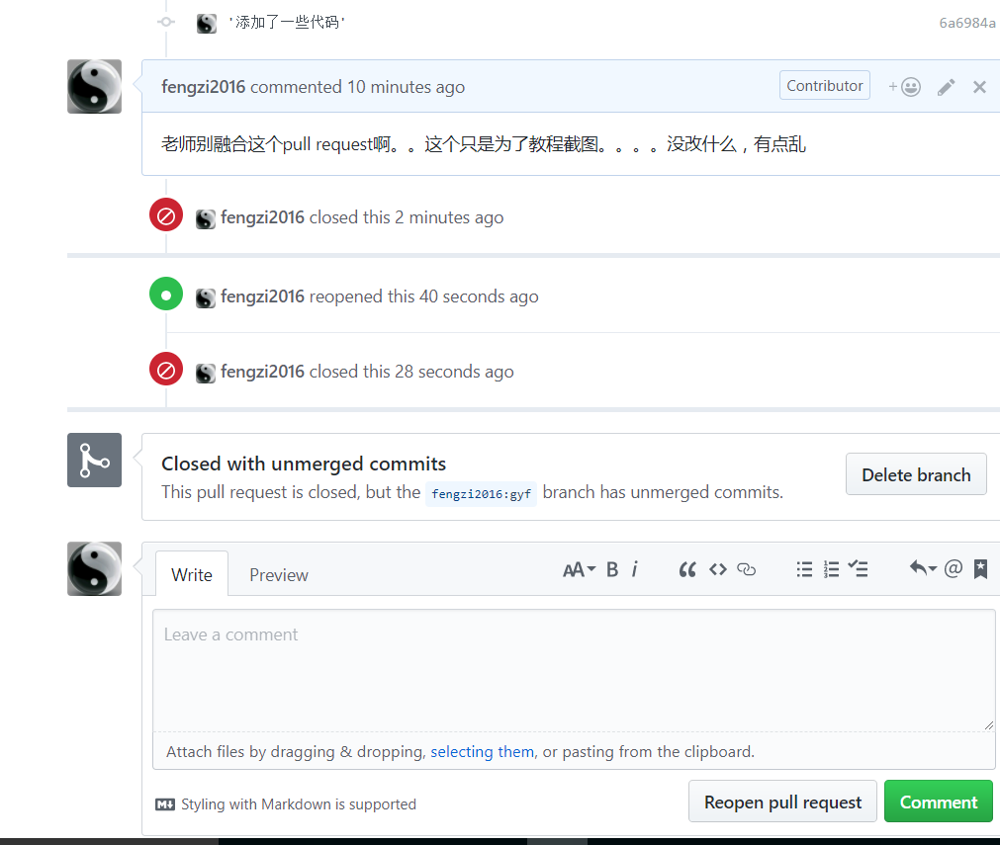

# 如何使用git进行pull request 操作
1. 当你修改了你clone下来的项目文件后，首先进入‘DATASTRUCTURE’文件夹（项目文件根目录）

2. Shift+右键，选择‘在此处打开命令窗口’
3. 在命令行中输入git add . 【意思是把工作区里的所有修改加入到缓存区】

4. 再在命令行中输入git commit   -m'你的备注信息'【意思是把缓存区的修改提交到本地仓库】

5. 再在命令行中输入 git push origin master:gyf 【意思是把你本地的master分支上的修改内容推到远程的自定义的gyf分支上，当然你也可以推到你的远程的mater分支上(直接输入git push)，而我推到我自定义的gyf分支上是为了防止我远程的master被推了错的代码之后又要修改】（注意：master:gyf 中的gyf是可以自定义的）

6. 再进入你自己的github网页，找到DATASTRUCTURE仓库，你就可以发现这里多了一个gyf分支提醒

7. 再点击右边的Compare & pull request 按钮
8. 当出现绿色字体的Able to merge【如果你出现了矛盾，说明在你之前有人也Pull request了而且还修改了同一行，这个时候你就戳老师吧】就可以直接点击Create pull request，第一个输入框写你这次融合的备注标题，第二个输入框你可以写写你修改了什么等详细信息

9. 这就代表你已经向老师发送了pull request请求了，等待老师审核后融合

10. 当你的pull request 被融合后，你在github上绑定的邮箱中会收到通知

11. 当然如果你后来发现你的Pull request代码有错误，而老师也没有融合，你可以直接关闭它，点击Close pull request，当然也可以重新打开，点击Reopen pull request

12. 当你的pull request 被融合后，或者被你自己关闭后，你就可以删除这个分支了（推荐删除，因为留着也什么用），点击Delete Branch,如果你想恢复这个分支，直接点击Restore就行了

13. 做完以上操作，你就学会了如何pull request